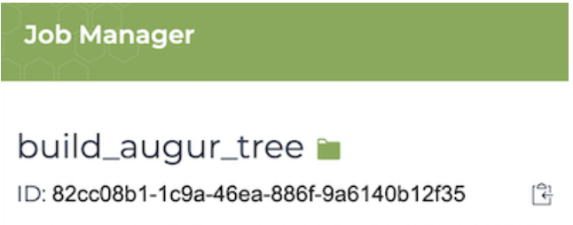

# The WDL Library


_Head chef: Ash O'Farrell (UC Santa Cruz)_

If you are viewing this document on GitHub, click on the ⋮≡ symbol on the upper left hand side, which will remain there as you scroll down this document. This will open a table of contents.

## Purpose and Intended Audience
WDL is a powerful workflow language, but it is specialized and relatively new. This means that most of the resources available on it are generated by developers of the WDL language itself rather than users or workflow creators. These official resources are quite helpful and serve as a useful source-of-truth, but when it comes to actually writing a workflow from scratch, it can be difficult to know where to start. Troubleshooting is likewise problematic, as the tried-and-true method of "googling the error code" is less helpful when a language has less users posting about said error code.

Dockstore is not only a repository of finished workflows, but also a general resource for successfully creating and using those workflows. In addition to this WDL-focused document, Dockstore has [comprehensive documentation](https://docs.dockstore.org/en/develop/getting-started/getting-started.html) on getting started with Docker and workflows in general. The goal of this document is not to replace that documentation but to supplement it with resources that don't quite fit the structure of traditional documentation.

This document is intended for those users who already have a basic understanding of WDL and its components, but are struggling with getting started writing their own workflow or debugging. If you are new to WDL, it may be best to start with [Dockstore's beginner WDL resources](https://docs.dockstore.org/en/develop/getting-started/getting-started-with-wdl.html) first.

This document is arranged in two sections. **Recipes** are large blocks of code to serve as an example or template of how to do a specific task in WDL. Some of these examples build upon each other, so it may be worth reading this section in order, but all instances are cross-referenced if you prefer to only read what you really need to know. **Tips** are more focused on small pieces of advice, more in the vein of a Stack Overflow post which reminds you that Python is zero-indexed instead of a full framework for using indices to extract elements from an array.

## Contribution
To contribute to this resource, open a pull request in the Github repo.

## Helpful External Resources
### General WDL usage
* [Dockstore: Getting Started with WDL](https://docs.dockstore.org/en/develop/getting-started/getting-started-with-wdl.html) 
* [The WDL 1.0 Spec](https://github.com/openwdl/wdl/blob/main/versions/1.0/SPEC.md)
* [miniwdl's WDL tips](https://miniwdl.readthedocs.io/en/latest/runner_advanced.html)
* [OpenWDL](https://openwdl.org/):
    * [OpenWDL GitHub Issues](https://github.com/openwdl/wdl) 

### Using WDL in the cloud
* [Terra's WDL documentation resources](https://support.terra.bio/hc/en-us/sections/360007274612-WDL-Documentation)
* [Cloud-based runtime attributes](https://cromwell.readthedocs.io/en/stable/RuntimeAttributes/)
* [Understanding and controlling cloud costs](https://support.terra.bio/hc/en-us/articles/360029748111-Understanding-and-controlling-cloud-costs-)

## Recipes
### Base cloud resources requested upon size of input files

There's no reason to request 100 GB of space from Google if you're just re-aligning a 300 MB cram file to the human genome. Instead of hardcoding a size, it's always better to base the value on the size of one's inputs.

However, this is problematic -- size() returns a float, but the disk runtime attribute must be an integer, and at first glance it may appear that WDL lacks a way to directly coerce floats into integers. While you could use some clever tricks involving strings to get around this, it's far easier and less error-prone to simply round up.

Here's an example of using ceil() to round up the size of your inputs, then adding them together to generate a final value for disk size.


```
task getReadLengthAndCoverage {
	input {
		File inputBamOrCram
		Array[File] allInputIndexes
		File? refGenome
	}

	command <<<
		set -eux -o pipefail

		if [ -f ~{inputBamOrCram} ]; then
				echo "Input bam or cram file exists"
		else 
				>&2 echo "Input ~{inputBamOrCram} not found, panic"
				exit 1
		fi
	>>>

	# Note that this is performed outside of the command section!
	Int refSize = ceil(size(refGenome, "GB"))
	Int indexSize = ceil(size(allInputIndexes, "GB"))
	Int thisAmSize = ceil(size(inputBamOrCram, "GB"))
	Int finalDiskSize = refSize + indexSize + thisAmSize

	runtime {
		disks: "local-disk " + finalDiskSize + " HDD"
	}
}
```


### Using the scatter function to perform a task on every X in an array
* "I want to do something on every file in an array."
* "I want something like a for loop."
* "I want to parallelize a process."
* "I want to create multiple instances of a WDL task."

See also: https://support.terra.bio/hc/en-us/articles/360037128572-Scatter-Gather-Parallelism 

WDL does not have loops in the sense that other programming languages do. If you want to perform a task on every file within a group of files, it is recommended to use `scatter`. This can be quite helpful if you are WDLizing something that normally only takes in one file at a time.

For example, here is a task that takes in one bam or cram file, runs a function from goleft on it, and then extracts the coverage from the output. This singular file is called `inputBamOrCram.`


```
task getReadLengthAndCoverage {
	input {
		File inputBamOrCram
	}
	command <<<
		goleft covstats -f ~{refGenome} ~{inputBamOrCram} >> this.txt
		COVOUT=$(tail -n +2 this.txt)
		read -a COVARRAY <<< "$COVOUT"
		echo ${COVARRAY[0]} > thisCoverage
	>>>
	output {
		Int outCoverage = read_float("thisCoverage")
	}
}
```


But we want to be able to input an array of files into this workflow, not just one at a time. So, when writing the workflow portion of the WDL, `scatter` can be used to call just one file from an array of inputs.


```
workflow covstats {
	input {
		Array[File] inputBamsOrCrams
	}

	scatter(oneBamOrCram in inputBamsOrCrams) {
		call getReadLengthAndCoverage as scatteredGetStats { 
			input:
				inputBamOrCram = oneBamOrCram
		}
	}
}
```


One important way that this differs from iteration is that `scatter` is parallized, while iteration via a for loop is not ([usually](https://stackoverflow.com/questions/29156704/what-is-a-parallel-for-loop-and-how-when-should-it-be-used#:~:text=The%20summing%20for%20loop%20can,such%20as%20separate%20CPU%20cores.)). For instance, let's say you had ten input files, but the second one was invalid in some way. If you were iterating through these files with a standard for loop in Python, then you would error out on that file and the remaining eight would not run. But using `scatter` in WDL is different -- all other instances of the task may complete. As such, `scatter` cannot replace for loops where order matters.


### Pass a scattered task's output to a non-scattered task
It is relatively easy to pass a scattered task's output to a non-scattered one. Building off the previous recipe, we can call another task in much the same way we pass output from any other task. Note that `call report` is outside the context of scatter.


```
workflow covstats {
	input {
		Array[File] inputBamsOrCrams
	}

	scatter(oneBamOrCram in inputBamsOrCrams) {
		call getReadLengthAndCoverage as scatteredGetStats { 
			input:
				inputBamOrCram = oneBamOrCram
		}
	}
	call report {
		input:
			readLengths = scatteredGetStats.outCoverage
	}
}
```


As noted in the previous recipe, each instance of `getReadLengthAndCoverage `returns a float. So, that means that the `report` task will be given an array of floats.


### Optional and default inputs with select_first
* "I want to create optional inputs with built-in defaults."

`select_first()` takes two arguments, the first one being a variable, the second being a value. If and only if the variable is not defined, `select_first()` will evaluate to the second argument. If the variable is defined, then it will evaluate to that variable. Let's take another look at [the scatter example from earlier on in this document](#using-the-scatter-function-to-perform-a-task-on-every-x-in-an-array), but add in another argument. This argument has the purpose of echoing the user's favorite animal. Why not?

```
workflow covstats {
	input {
		Array[File] inputBamsOrCrams
		String? favoriteAnimal
	}
	# Figure out which animal to use, fall back to dogs if none specified
	String animal = select_first([favoriteAnimal, "dog"])

	# Call covstats
	scatter(oneBamOrCram in inputBamsOrCrams) {
		call getReadLengthAndCoverage as scatteredGetStats { 
			input:
				inputBamOrCram = oneBamOrCram,
				animal = animal
		}
	}
}
```

Now, let's update our task to include `animal` as an input.

```
task getReadLengthAndCoverage {
	input {
		File inputBamOrCram
		String animal
	}
	command <<<
		goleft covstats -f ~{refGenome} ~{inputBamOrCram} >> this.txt
		COVOUT=$(tail -n +2 this.txt)
		read -a COVARRAY <<< "$COVOUT"
		echo ${COVARRAY[0]} > thisCoverage

		echo ~{animal}
	>>>
	output {
		Int outCoverage = read_float("thisCoverage")
	}
}
```

If the user does not define `animal`, then `animal` will be undefined and `select_first()` will evaluate to "dog". If the user defines anything for `animal`, then whatever the user defined will be used. Beware, "bad" input will still take precedence; all that `select_first()` is looking at is whether or not something is defined!


### Using if/else in WDL
WDL allows for limited if/else reasoning when it comes to setting variables. You can use this to set runtime arguments in tasks, such as this:

```
runtime {
	disk: if howBigShouldDiskSizeBe == "very big" then "local-disk 400000 SSD" else "local-disk 10 SSD"
}
```

You can also use if statements to optionally call certain tasks. For example, if the user sets check_gds to `true`, then the check_gds_files task will be called. If not, the check_gds_files task will not be called. Because the actual workflow output is derived from the vcf2gds task, which will always run regardless of what `check_gds` is set to, `vcf2gds.gds_output` will always be defined (provided vcf2gds has an output called `gds_output` of course), so the workflow level output will always be valid.

```
workflow vcftogds {
	input {
		Array[File] vcf_files
		Boolean check_gds = false
	}

	scatter(vcf_file in vcf_files) {
		call vcf2gds {
			input:
				vcf = vcf_file
		}
	}

	if(check_gds) {
		scatter(gds in vcf2gds.gds_output) {
			call check_gds_files {
				input:
					gds = gds
			}
		}
	}

	output {
		Array[File] gdss = vcf2gds.gds_output
	}
}
```
What's the point of a workflow like this if the workflow-level output isn't influenced by check_gds_files? It doesn't need to be. If check_gds_files finds something wrong, it can simply throw an error, resulting in the workflow failing. More detailed results could be gleaned from log files from check_gds_files. Remember, if a workflow fails, task-level outputs are also saved.

However, you cannot use else statements in this maybe-run-a-task-maybe-not manner. WDL lacks an "else" keyword for anything besides setting a variable's value. Also, WDL executors generally cannot tell if two if statements are mutually exclusive.

### Call a WDL with another WDL
There are times that you will want to call one WDL file from another. This is most commonly used in checker workflows, which call a workflow with known inputs and compare the outputs with known truth files. Usually, the easiest way to import a WDL into another WDL is to import the raw github URL (it must be the raw version) of the workflow you want to import. This import should go on the very top of your WDL, just under the version number.

```
import "https://raw.githubusercontent.com/DataBiosphere/topmed-workflows/1.32.0/aligner/u_of_michigan_aligner/u_of_michigan_aligner.wdl" as TopMed_aligner
```

Now that your WDL is imported, you have two options here. Either you can call the entire workflow, or you can call steps within the imported workflow.

As an example for calling the entire workflow, see the [TOPMed U of Michigan Aligner Checker WDL](https://dockstore.org/workflows/github.com/DataBiosphere/topmed-workflows/checker_UM_aligner_wdl:1.32.0?tab=files). The not-checker WDL that the checker WDL imports starts like this:


```
workflow TopMedAligner {
	[...]
}
```


And, as seen earlier, we imported the WDL as TopMed_aligner. Therefore, in the checker WDL, the aligner can be called like this:


```
call TopMed_aligner.TopMedAligner as aligner {
	[...]
}
```


Where `TopMed_aligner` refers to the name used in the import statement and `TopMedAligner` is the name of the workflow as given within that imported file. However, if you wanted to call the tasks instead, simply replace `TopMedAligner` with the name of the step you wish to call, such as `PreAlign`.

Keep in mind that whenever you call a WDL from another WDL, both of them must be of the [same version of WDL](#wdl-versions). Also keep in mind that it is generally bad security practice to link WDLs to other WDLs outside of the context of checker workflows.


## Tips
### Variables
#### Variable scope

A lot of issues that pop up when writing WDLs come down to the fact that a WDL can have two different sets of variables in the command section, but when using curly brace notation, they tend to be written in the same way. It is clearer to talk about this using chevron notation, so I'll discuss it in that context. (I recommend always using chevron notation anyway.) 

When using chevron notation for a command section, an input variable is written ~{likeThis}. This is different from a bash variable, which is usually written $likeThis. **An input variable must be defined in the input section of a task section. A bash (or whatever language you are using) variable must be defined in the command section itself.**

For example, the following will NOT work, because ~{readLengthFiles_string} is not defined as an input in the input section.

```
task gather {
    input {
        Array[File] readLengthFiles
    }

    command <<<
        readLengthFilesCopy = ~{readLengthFiles}
        echo ~{readLengthFilesCopy} >> out.txt
    >>>

    output {
        File out = "out.txt"
    }
}
```

However, this is easily fixed by just switching the bash variable, defined in the command section, with bash variable notation.

```
task gather {
    input {
        Array[File] readLengthFiles
    }

    command <<<
        readLengthFilesCopy = ~{readLengthFiles}
        echo ${readLengthFilesCopy} >> out.txt
    >>>

    output {
        File out = "out.txt"
    }
}
```

#### Variables in filenames

There are two different ways that you should represent a filename with a variable.

In the command part of a WDL, if the variable is an input variable, then it should follow input variable syntax.

✅samtools index ~{inputBam}
❌samtools index ${inputBam}

In any other part of a WDL, such as in a task's output section, it can follow bash syntax, even if it is an input variable.

✅ File bamIndex = "${inputBam}.bai"
❌ File bamIndex = "$inputBam.bai"
❌ File bamIndex = "$(inputBam).bai"
❌ File bamIndex = "inputBam.bai"


## Command Section Syntax
### Be careful with comments
Because command sections of a WDL can interpret BASH commands, and BASH commands make use of the # symbol, womtool (and possibily other parsers) can misinterpret comments as syntax. This usually only happens if there are special characters in the comment; alphanumerics should work fine.

This will work:

```
command <<<
    echo foo  # this is a valid comment 
>>>
```

This will fail womtool: 

```
command <<< 
    echo foo  # using <<<this syntax>>> for your command section is ~{very cool}! >>>
```

### Chevron syntax
The command section of a WDL task can contain valid bash syntax, which often contains {curly braces}. However, the command section of a WDL task can also start with those very braces. In some circumstances the parser has difficulty with this combination, which is why the WDL allows -- and in some cases encourages -- using alternative syntax for the command section. This alternative syntax looks like this:


<table>
  <tr>
   <td>standard syntax
   </td>
   <td>chevron syntax
   </td>
  </tr>
  <tr>
   <td><code>command {</code>
<p>
<code>}</code>
   </td>
   <td><code>command &lt;<&lt;</code>
<p>
<code>>>></code>
   </td>
  </tr>
</table>


A surprising number of common errors can be sidestepped by using chevron syntax, so it is worth trying should you have trouble with a command in WDL.


## Good Practices
### Maximize reproducibility by knowing what scripts will be run
A user putting the same data into your workflow should get the same output as someone else running on the same data. You can ensure this by making sure that's what's actually happening is always the same, or at least, as similar as possible. Some general guidelines to do this:
* Do not allow users to specify a Docker image
	* If you need to do some sort of fork where "if data is X use Docker A, if data is Y use Docker B," consider writing two tasks, with each task differing only in name and what Docker image they are using. This will at least create a clear record as to which container was used, as the task name will be shown in logs. It's not a perfect solution, especially considering WDL lacks `if/else` logic, but if something goes wrong, this method may be a little easier to troubleshoot than simply printing the name of the Docker image being used to the logs.
* Do not import scripts from other places -- everything should be pre-packaged in your Docker image
	* This includes other WDLs!
* Do not be afraid of printing helpful information to stdout.

Note that there are exceptions to these guidelines! For example, checker workflows always need to import the workflow they are checking.

## Runtime Attributes
Runtime attributes are defined in the runtime section of a WDL section. The WDL 1.0 spec only defines two runtime attributes, `docker` and `memory`. All other runtime attributes are at the whims of the WDL executor you are using.

* [Cromwell runtime attributes](https://cromwell.readthedocs.io/en/stable/RuntimeAttributes/)
* [miniwdl runtime attributes](https://miniwdl.readthedocs.io/en/latest/runner_reference.html#task-runtime-attributes)
* [WDL 1.0 spec runtime attributes](https://github.com/openwdl/wdl/blob/main/versions/1.0/SPEC.md#runtime-section)


### Allow users to easily change runtime attributes
A recipe in this document shows how to have the user set the docker container that a task executes in. You can use the same logic to allow the user to specify how much memory a task will use when run on the cloud, for instance, or whether or not preemptibles should be used if running on Google Cloud Compute specifically.

It's generally a good idea to give users at least some control over memory and disk size. Also consider giving users the ability to use preemptibles -- your users may want to perform a quick run on downsampled test data, which could be a good use case for preemptibles. Alternatively, your users may consider running your WDL on more data than you've considered, which could preclude preemptibles on a task you'd otherwise consider to run within a reasonable timeframe.


### Not all runtime attributes are relevant to all platforms
Running WDL locally will ignore a WDL's values for runtime attributes that only apply to the cloud. For example, when using Cromwell, CPU and memory are recognized when running on AWS, GCP, or HCP, but do nothing on other platforms. This means if you have an error in a cloud-platform-only attribute, it will go undetected on your local runs. However, there are a handful of runtime attributes which are valid for both local and all cloud runs, such as `docker`.

### Some runtime attributes act differently on different platforms
In addition to not all platforms sharing the same runtime attributes, in some cases the same attribute can mean different things on different platforms. For instance, when using Cromwell, GCP tends to interpret memory as a minimum, but most HCP systems default to interpreting it as a maximum.

### Have some wiggle room for storage
_Note: This section applies to Cromwell. miniwdl appears to handle disk space differently._

When running on any cloud system besides AWS, you can use the disks attribute to request a certain amount of storage. If you are scaling your request disk storage size to the size of your inputs, it's a good idea to add some wiggle room. This is especially important if you know that a file will be reprocessed in some way that creates intermediate files. If you are using `ceil()` [like suggested earlier](#base-cloud-resources-requested-upon-size-of-input-files), you will already be rounding up. But if you run into errors about there not being enough space left, it's worth adding a few extra gigs in your calculation. You may even want to make it a multiple of one of your inputs. For instance, we can adjust the formula from the recipe to make it a multiple of our input cram file. Usually, multiplication of an input like this isn't necessary, but it is worth trying if you are plagued by `no space left on device`.

```
Int finalDiskSize = refSize + indexSize + (2*thisAmSize)
```

This is not relevant to AWS, as AWS EBS autoscales to the necessary size. Storage also does not apply to local runs.

### If at first you don't succeed, set maxRetries
Both Cromwell and miniwdl support `maxRetries` as a runtime attribute. If this is set to a nonzero value, your task will attempt to re-run if it fails.

### Cromwell can handle preemptible interruptions for you
If you include the runtime attribute `preemptible` in your WDL, you can specify the maximum number of times Cromwell will request a [preemptible machine](https://cloud.google.com/compute/docs/instances/preemptible) from Google for a task before defaulting back to a non-preemptible machine. For instance, if your set  `preemptible: 2`, your workflow will attempt a preemptible at first, and if that machine gets preempted, it will try again with a preemptible again, and if that second try is preempted, then it will use a non-preemptible.

Preemptibles are counted separately from `maxRetries`, assuming the failure while running on preemptibles is caused by the machine being preempted.

### Some runtime attributes must use integers and/or strings
When running on Google Cloud, the `disk` and `memory` runtime attributes must contain numbers of type int, not float. This is a limitation imposed by Google, not WDL executors.

However, disk and memory are somewhat unique -- although they must contain integers (at least on GCP), their overall format actually needs to be a string.

In the case of size, it must be a space-separated string containing three things:

1. Either the mount point as an absolute path
2. An integer representing disk space, in GB
3. Disk type, which can be either LOCAL, SSD, or HDD.

The [memory runtime attribute](https://cromwell.readthedocs.io/en/stable/RuntimeAttributes/#memory) is a bit more flexible. While it still must be a string containing an integer, it does not need to be space separated. The following are all valid entries for memory:

* memory: "4G"
* memory: "4 G"
* memory: "4 GB"
* memory: "4000 MB"

## Different versions of WDL
There are multiple different versions of WDL. **In general, most users will want to use WDL 1.0 formatting.** To support older WDLs, Cromwell (and by extension the Dockstore CLI) will accept valid WDLs that follow a draft specification. Versioning is performed in the first line of your WDL and is written in plaintext, such as

```
version 1.0
```

Per [the official WDL spec](https://github.com/openwdl/wdl/blob/main/versions/1.0/SPEC.md#versioning), this first-line versioning must be used if a WDL file is intended to be parsed as anything except the second version of the draft (draft-2) specification. This specification is done at the top of the file with a comment. For simple WDLs, this is usually inconsequential, but it's good to get into the habit of versioning your WDLs as you will likely eventually want to use syntax not present in draft-2.

All WDL files within a given workflow must use the same version of WDL. If a WDL with "version 1.0" at the top (which will be parsed as 1.0) tries to call a WDL without an explicit version number (which will be parsed as draft-2), the process will fail even if the contents of the files otherwise should be compatible.


### Some functions have changed in in WDL 1.0
As you might expect, certain functions work differently or are removed altogether in different versions of WDL. One that is worth notice is sub(), as it was sometimes used in draft versions to coerce floats into integers. This is valid in draft-2, so if your WDL does not specify `version 1.0` at the top, the following would be valid:

```
disks: "local-disk " + sub(disk_size, "\\..*", "") + " HDD"
```

However, this is invalid in WDL 1.0 where it will not even pass womtool. It is better to use `ceil()` to coerce floats into integers, as shown in [this recipe](#base-cloud-resources-requested-upon-size-of-input-files).

### Cromwell lags behind the current WDL spec
According to its git history, the WDL 1.1 spec was finalized around February 2021. As of my writing this (mid-July 2022), to my knowledge, Cromwell does not support WDL 1.1 nor is there a public roadmap for it picking up WDL 1.1 support. If you are writing a WDL for Terra, **do not** use WDL 1.1 features. If you are writing a workflow that must use a WDL 1.1 feature, consider using a different WDL executor which does support WDL 1.1, or asking on Stack Overflow or elsewhere for advice on creating a WDL 1.0-compatiable workaround.


## Miscellaneous
### Use pipefail to catch errors early
Towards the beginning of a command section within a task, it's good practice to include the following:

```
set -eux -o pipefail
```

Among [other things](https://vaneyckt.io/posts/safer_bash_scripts_with_set_euxo_pipefail/), this will make sure that your pipeline fails whenever a task returns something that isn't 0. This can be helpful if you have a long task that you don't wish to continue should something fail upstream. It can also catch more rare situations where a failure does not return 1, such as if you are running something in Golang. Remembering to set this will prevent errors from escaping your notice, or falsely seeming to succeed only to cause other errors later down the line.


### User-set inputs should be defined thrice
When it comes to inputs that the user directly passes in at the start of a workflow, it can be helpful to remember the "rule of three." Inputs should be defined as a workflow input and a task input, plus in the workflow call section, for a total of three.


```
task index {
	input { 
		File bamFile 
	} 
	command <<< do something >>>
}
workflow indexABam {
	input { 
		File bamFile 
	}
	call index { input: bamFile = bamFile } 
}
```

### Know the quirks of your workflows
The more you know about what you are WDLizing, the easier and more foolproof the process will be. For instance, if you know what you are trying to WDLize will reindex an input file (such as cram) if you do not also include an index file (such as crai), you will likely want to account for slightly more disk space to allow for that indexing to occur. If, on the other hand, you know that your tool will fail later on down the line if no index file is provided, then you can ensure that the user includes the index by making them non-optional, allowing the workflow to exit quickly rather than fail after spending time and money on previous steps.


### Keep the purpose and scope of WDL in mind
If you are new to writing workflows, it is worth keeping in mind that **WDL is designed to run a series of commands, not be a stand-alone programming language in its own right**. If you are struggling to do something in WDL, it is worth taking a step back and thinking if it can be done with its own tasks. For instance, you may find it easier to parse your output as a task in WDL that calls upon a parsing script rather than trying to manipulate outputs within a workflow description section.


### Scattered tasks do not share allocated resources
Every instance of a scattered task is given the resources allocated to it in the task section of your WDL.

Let's say you are running an analysis on GCP, which makes use of the `memory` runtime attribute, and as an input you pass in an array of three files. You run a scattered task on this array, creating three instances of that task. In your WDL, you gave that task a runtime attribute of 15 GB of memory. Every instance of that task will be given 15 GB of memory, rather than each instance being allocated 5 GB of memory.

### Get familiar with womtool
womtool is Cromwell's built-in syntax validator, but it is also capable of generating a "skeleton" JSON file for a given WDL file, which you can use to quickly create input JSONs for your WDL file. You can read about that and its other uses on [Cromwell's documentation page](https://cromwell.readthedocs.io/en/stable/WOMtool/).

You can download womtool as its own jar file from [the Cromwell release page](https://github.com/broadinstitute/cromwell/releases/). In addition to the features just mentioned, the jar file can also be helpful for validating several WDL files rapidly without having to run them all on Cromwell, as it is the same tool used by Cromwell to validate syntax. When running WDL on the Dockstore CLI, womtool is also involved as the Dockstore CLI calls Cromwell, which contains womtool. Be aware that womtool's validation is checking for valid syntax -- as with all syntax validators it's still possible to have nonfunctional code that is still syntactically correct.

### Try a new WDL executor
Cromwell is what's used by Terra, but it isn't the only executor out there. If you would like something Python-based and/or less verbose, you may want to try [miniwdl](https://github.com/chanzuckerberg/miniwdl). Another Python-based executor is [Toil](https://toil.readthedocs.io/en/latest/running/wdl.html#wdl), although it should be noted its support for WDL is in alpha.

## Terra-specific Tips
### Use Firecloud API to help you debug
#### Get a full error traceback
You can use the following part of the Firecloud API to get a huge amount of information about your run. This will include all error codes associated with your WDL, which can be helpful, as Terra's current (it is July 2022 as I write this) UI does not show the full traceback when an error occurs.

https://api.firecloud.org/#/CromIAM%20Workflows%20(for%20Job%20Manager)/get_api_workflows__version___id__metadata

#### Download a WDL used on a Terra run to your local machine
_Note: While this has been made somewhat obsolete by a change in Terra's UI, it may still be useful to power users who wish to check multiple submission's WDLs quickly, or if you wish to recover a WDL from a Terra run (such as if you deleted your local copy)._

If you are developing a workflow and need to run multiple tests on Terra, you'll probably be updating your workflow a lot. When you go to run a workflow, you will be able to select the version -- release number or branches if imported from Dockstore, or snapshot if imported from the Broads Methods Repository. If you are running multiple versions of the same workflow, you might lose track of which run correlates to which WDL. While the WDL is now visible in the UI, if you prefer, you can extract the WDL once a workflow has finished using your local machine's command line.

When you click the "view" button to bring up the job manager, take note of the ID in the top, not to be confused with the workspace-id or submission-id.



You can use this ID on your local machine's command line to display the WDL on stdout.

```
curl -X GET "https://api.firecloud.org/api/workflows/v1/PUT-WORKFLOW-ID-HERE/metadata" -H "accept: application/json" -H "Authorization: Bearer $(gcloud auth print-access-token)" | jq -r '.submittedFiles.workflow'
```

Note that you will need to [install gcloud and login with the same Google account that your workspace uses](https://cloud.google.com/sdk/docs/quickstarts), and you will need jq to parse the result. jq can be easily installed on Mac with `brew install jq`

With this quick setup, you'll be able to check the WDL of previously run workflows, which can be helpful if you are running multiple versions of the same workflow to aid with debugging. To make this process more efficient, put a comment in the WDL itself explaining how each WDL differs.


### General data access issues on Terra
#### Using DRS URIs
DRS is a GA4GH standard providing a cloud-agnostic method to access data in the cloud. For NIH cloud platform users (BioData Catalyst, AnVIL, etc.), it is currently used to access data hosted by the Gen3 platform. When data is imported to Terra from Gen3, you will see that genomic files are accessed via "drs://" (rather than "gs://").

Cromwell in Terra will automatically resolve DRS URIs for you ([assuming your credentials are up-to-date](#make-sure-your-credentials-are-current)), so most WDLs will be able to use DRS URIs without any additional changes. 

However, depending on how your inputs are set up, some changes might be necessary, such as if you're using symlinks. When working with DRS URIs, sometimes you will want to have your inputs be considered strings rather than file paths.[This diff on GitHub](https://github.com/DataBiosphere/topmed-workflow-variant-calling/pull/4/files) shows the changes that were needed to make an already existing WDL work with DRS URIs on Terra. Although it is a somewhat complicated example, it may be a helpful template for your own changes.

#### Use gs rather than https inputs
If one of your inputs is in a Google bucket that you otherwise have access to (such as Google's own public genomics bucket), access it on Terra using its gs:// form rather than its storage.google.com form. You can just replace https://storage.google.com inputs with gs:// to do so; the remainder of the address will be the same. For instance,

```
https://storage.google.com/topmed_workflow_testing/topmed_aligner/reference_files/hg38/hs38DH.fa
```

becomes

```
gs://topmed_workflow_testing/topmed_aligner/reference_files/hg38/hs38DH.fa
```

#### Make sure your credentials are current
If you are having issues accessing controlled-access data on Terra, try refreshing your credentials. See Terra support on [linking Terra to external services](https://support.terra.bio/hc/en-us/articles/360038086332).

## Concluding Thoughts
If, when writing a WDL, you think to yourself "something about this workaround feels ridiculous," you are probably on the right track. Writing a WDL is not like writing in a standard programming language, because WDL is not designed to be a standard programming language.
